## **วิธีการติดตั้ง MetaMask Extension **

**ขั้นตอนที่ 1:** ดาวน์โหลด <a href="https://metamask.io" target="_blank" rel="noopener noreferrer">MetaMask</a>

**ขั้นตอนที่ 2:** คลิก “Add to Chrome” เพื่อ Install MetaMask

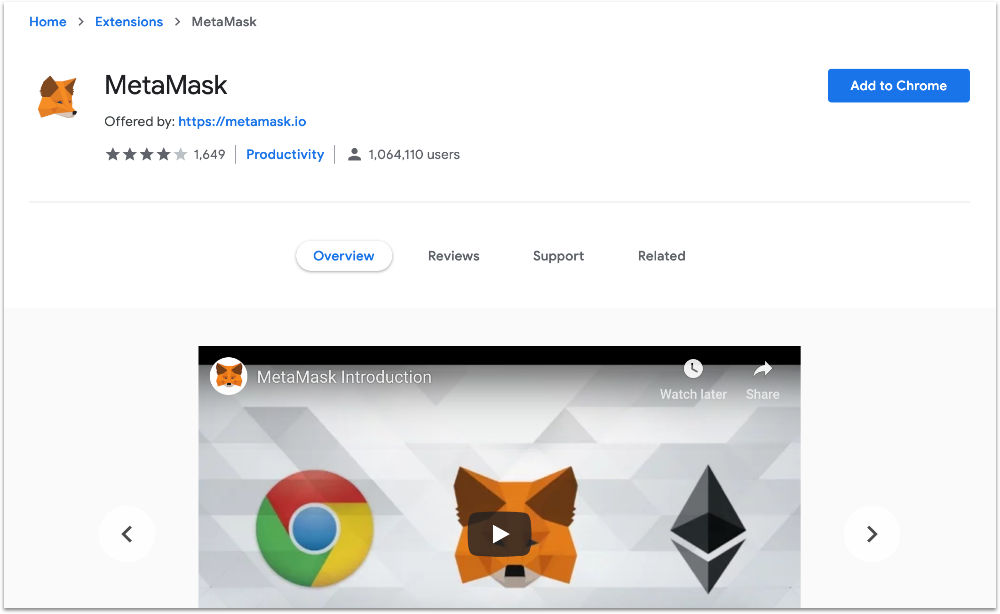

เมื่อทำการเพิ่ม Matamask เข้า Extension ของ Bowser เสร็จก็จะเจอหน้านี้

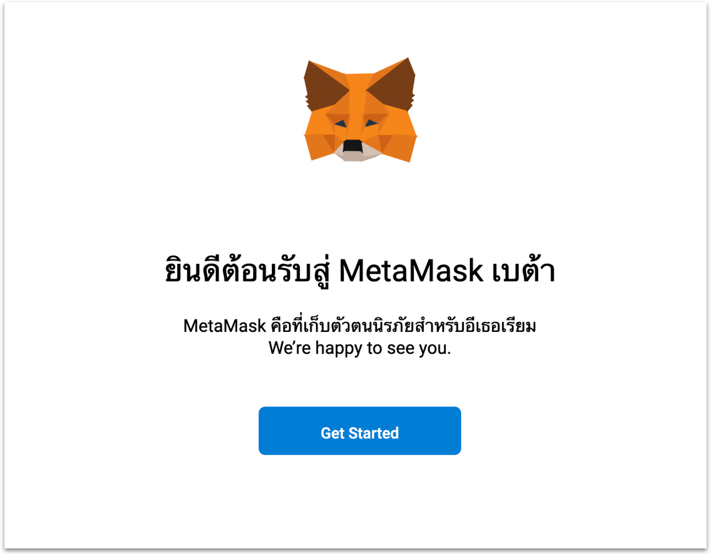

**ขั้นตอนที่ 3:** ทำการสร้าง Wallet หรือถ้าใครมี Wallet อยู่แล้วก็สามารถ Import
เข้ามาได้นะครับแต่ในเอกสารชุดนี้จะอธิบายในส่วนของการสร้างใหม่นะครับ ให้คลิกปุ่ม **Create a Wallet**

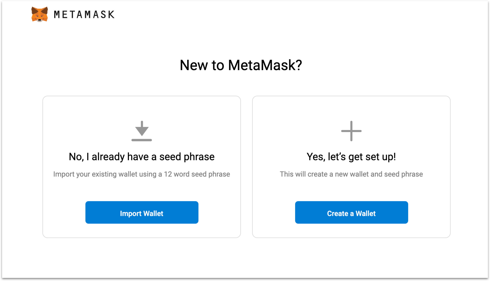

เมื่อคลิกสร้าง Wallet แล้วจะเจอหน้านี้ให้กด **I agree** นะครับ

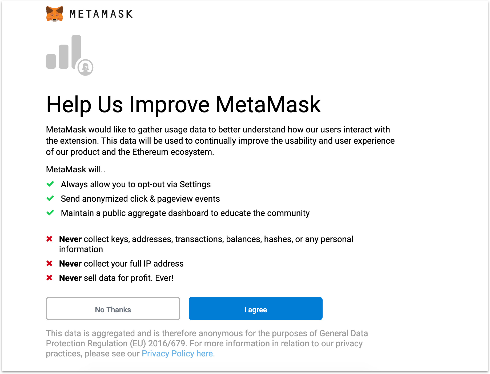

ต่อไป Matamask จะให้เราทำการสร้าง Password ของ Wallet เรา

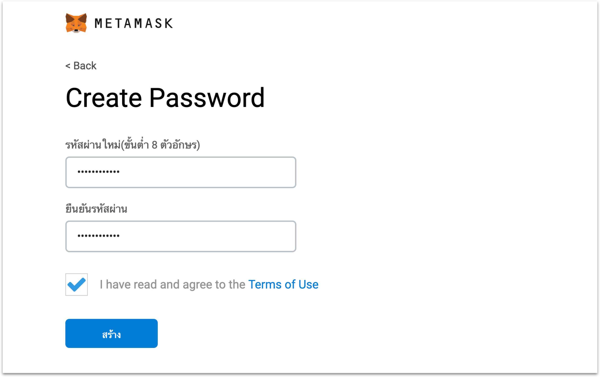

**ขั้นตอนที่ 4:** ขั้นตอนนี้สำคัญมาก เพราะ Metamask จะสร้างชุดคำมาให้คุณเก็บไว้อย่าเอาให้ใครเป็นอันคาดเพราะถ้าหากใครได้ไปนั้นหมายความคนนั้นก็เป็นเจ้าของ Wallet ของคุณทันที

**`Not your key Not Your Coin`**

ให่ทำการคลิกตรงกรอบสีแดงเพื่อทำการดูชุดคำ และต้องเก็บรักษาไว้ให้ดี

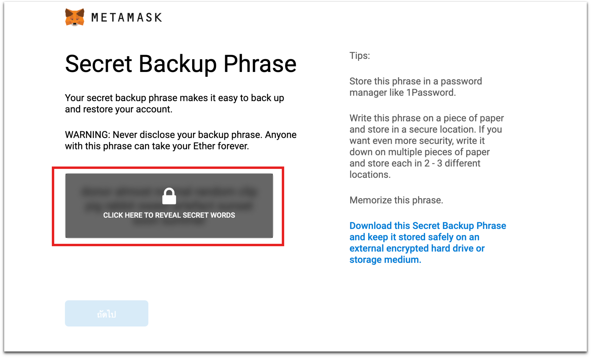

เมื่อทำการเก็บชุดคำไว้แล้วก็กด ถัดไป จะเจอหน้าให้ Confirm ชุดคำที่ได้

และเมื่อทำตามขั้นตอนอย่างถูกต้องก็เป็นอันเสร็จสิ้นสำหรับการสร้าง Wallet ด้วย Matamask

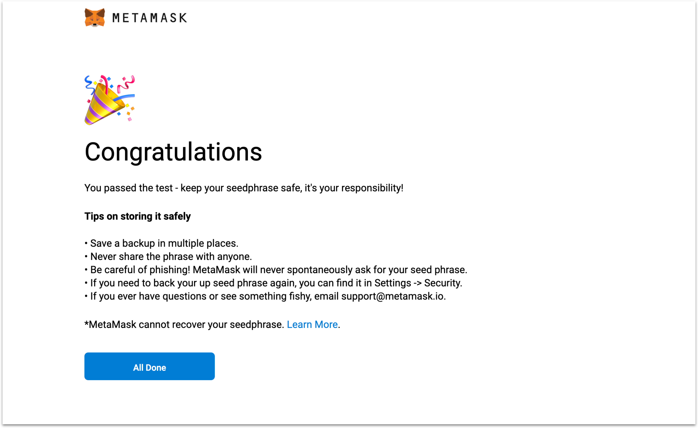

เพียงเท่านี้ก็มี Wallet ของสกุลเงินดิจิตอล Ethereum เรียบร้อยแล้ว

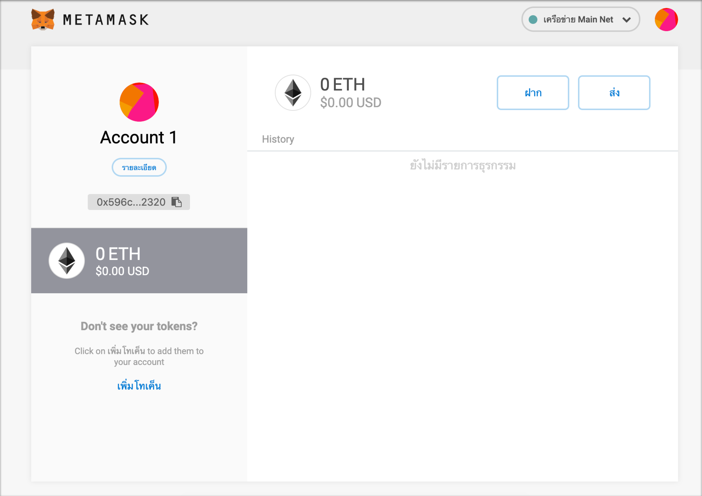

---

## **ขั้นตอนรับเหรียญ Eth ฟรี เพื่อทดสอบระบบ**

จากขั้นตอนการสร้าง Wallet ข้างต้นจะสังเกตว่าเรายังไม่มีเหรียญ Eth ซึ่งการที่เราจะใช้งาน DApp (Decentralized Application) บนเครือข่ายของ Ethereum นั้นจำเป็นต้องมีเหรียญ Eth ก่อน

ซึ่งระบบ Thai Election 2019 ทางผู้พัฒนามีวัตถุประสงค์ที่ต้องเป็นกรณีศึกษาการทำงานของ Smart Contract และเผยแพร่ความรู้ในด้านการใช้งาน DApp (Decentralized Application) เพียงเท่านั้น ดังนั้นระบบจะทำงานอยู่บนเครือข่ายทดสอบที่ชื่อว่า `Ropsten`

**ขั้นตอนที่ 1:** จากรูปด้านบนให้เปลี่ยนเครือข่ายจาก `Main Net` เป็น `Ropsten`

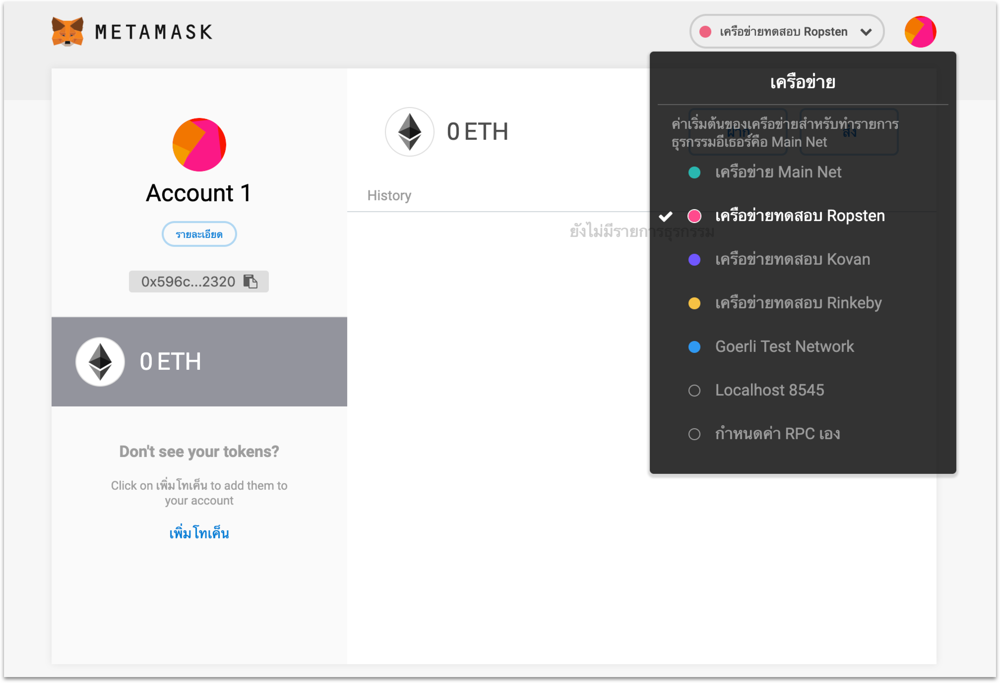

**ขั้นตอนที่ 2:** ให้เข้าไปที่เว็ปไซต์ <a href="https://faucet.metamask.io" target="_blank" rel="noopener noreferrer">faucet.metamask.io</a> เพื่อทำการรับเหรียญ Eth บนเครือข่ายทดสอบที่ชื่อว่า `Ropsten`

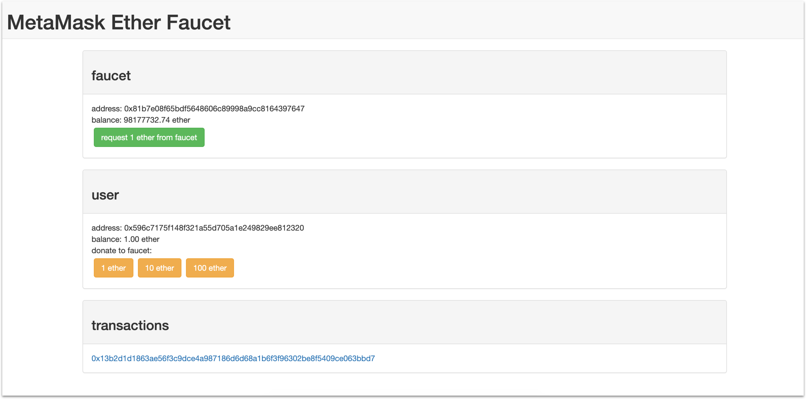

โดยให้กดปุ่มสีเขียวจากภาพด้ายบนเพื่อทำการร้องขอเหรียญ Eth จำนวน 1 Eth หลังจากส่งคำขอไปแล้วอาจจะต้องรอสักพัก

หลังจากรอมาสักพักเราก็จะได้รับเหรียญ Eth จำนวน 1 Eth บนเครือข่ายทดสอบที่ชื่อว่า `Ropsten` ดังรูปด้านล่าง

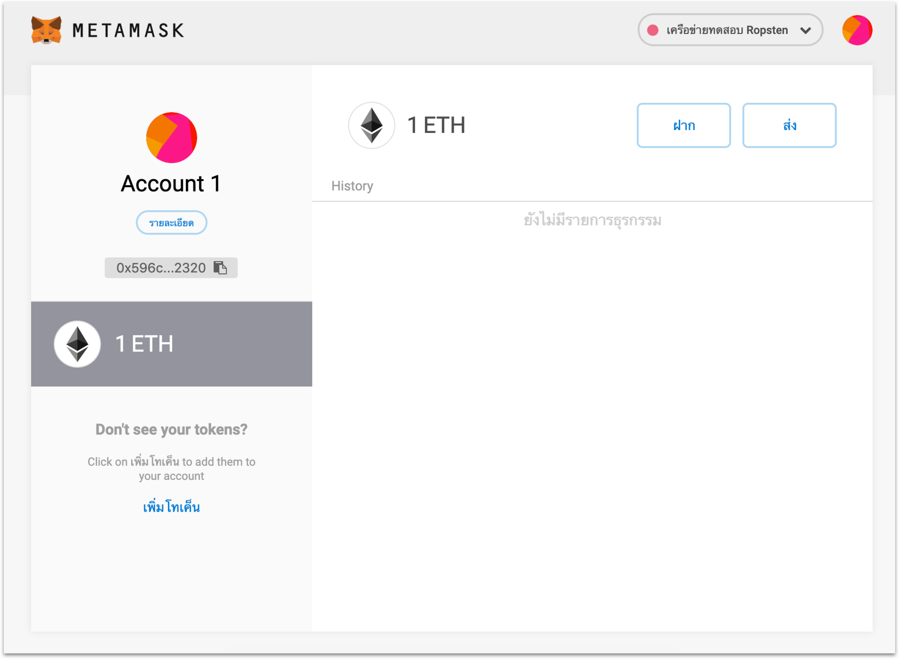

หลังจากรับเหรียญเสร็จเรียบร้อยแล้วก็สามารถเข้าใช้งานระบบ Thai Election 2019 ได้แล้ว ย้ำระบบนี้มีวัตุประสงค์ที่จัดทำขึ้นเพื่อเป็นกรณีศึกษาเกี่ยวกับการทำงานของ Smart Contract และเป็นการเผยแพร่การใช้งาน DApp (Decentralized Application)
